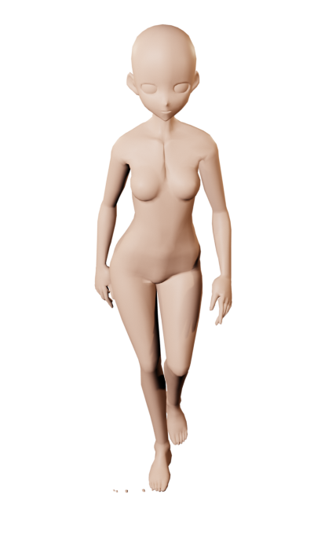
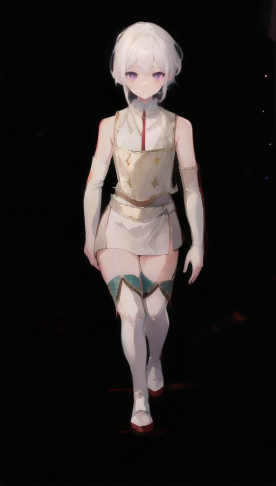

# Animation Generating Walkthrough

## Overview

This repository provides a set of nodes and workflows to facilitate the generation of animations using InvokeAI. The primary focus is on creating walk animations for 2D game characters, covering views such as front, back, and side for 4 directional movements. However, the tool can be adapted for generating various animations. This README will guide you through the process, particularly demonstrating the creation of walk animations.

## How It Works

The workflow reads rendered images generated from 3D objects. It utilizes the openpose processor, blending it with the renders frame by frame to produce a GIF, resulting in the desired animation.

## Setup

Before you begin, ensure you have the necessary components downloaded from this repository. Additionally, you'll need a Blender scene to generate images representing each frame. Follow these steps:

1. Download Blender.
2. Find a rigged .obj character you like (or create one).
3. Upload the character to Mixamo, download a preferred animation.
4. Follow a recommended Blender tutorial ([I used this one](https://www.youtube.com/watch?v=l1Io7fLYV4o)).
   - Note: If rotation is challenging, set up multiple cameras for different views, and change main camera per angle instead.
5. Use a black background for rendered images instead of transparency for optimal Openpose processor performance.
6. Check the lighting, ensuring the model is well-lit and visible. Adjust as needed.
7. After confirming Openpose performance, you can revert the background to transparency.

## Major Steps in the Process

1. **Image Processing:**
   - Read the image and send it to the openpose processor to generate a pose.
   - Note: Openpose results may vary based on input image quality, model visibility, and frame rate.

2. **Denoising Latent:**
   - Before denoising, pass the raw rendered image into the node.
   - Adjust denoising value based on animation preferences.
     - Higher values for consistent animation.
     - Lower values for AI creativity (e.g., 0.4 for prompt-based clothes generation, 0.5 for overpainted details).

3. **Face Correction:**
   - A separate prompt for face correction; input facial information here.

## Input-Output Results

### Example:

| **Input** | **Output**|
|:---:|:---:|
| | |

### Result Animation

 

**Observations:**

- Limb placement accuracy contributes to decent animations.
- Some features defined in the prompt might be ignored, but this is mitigated if the input image aligns with prompt features.
- Manual adjustments may be required for each frame.

Feel free to experiment and tailor the settings to achieve your desired animation outcomes!
